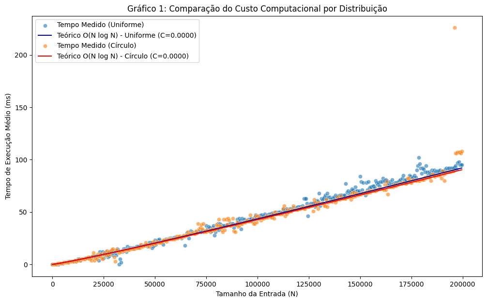
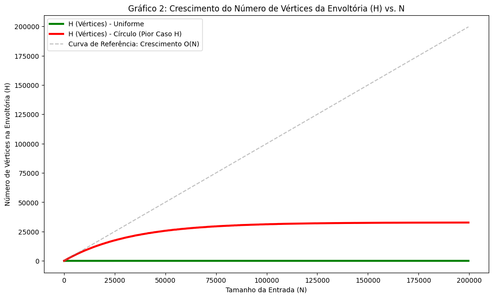
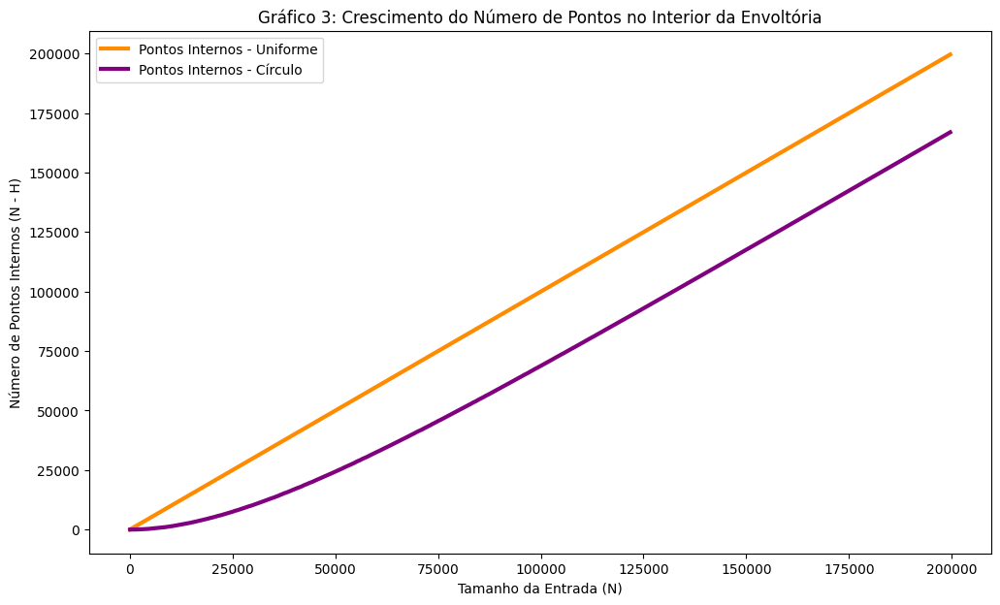

# Análise de Algoritmos: Envoltória Convexa (Varredura de Graham / Monotone Chain)

## 1. Introdução

Este projeto implementa e analisa o algoritmo de **Envoltória Convexa** (Convex Hull) para um conjunto de pontos 2D. Utilizamos uma variação do algoritmo de Varredura de Graham (Graham Scan) ou Monotone Chain de Andrew, conhecido por sua eficiência em tempo de execução. O sistema permite a interação via interface gráfica (p8g) para criação manual e aleatória de pontos.

**Complexidade de Tempo Assintótica:** O(N log N)

## 2. Implementação do Algoritmo

O algoritmo foi implementado nas funções `ordenaPontos()` e `criaEnvoltoriaConvexa()` da classe `Unidade`, seguindo uma variação do algoritmo de Varredura de Graham (Graham Scan) ou Monotone Chain, conhecido por sua eficiência em tempo de execução.

*O funcionamento do Graham Scan, que inspira a lógica de empilhamento do algoritmo, é visualmente bem explicado em: Dino Cajic. "Graham's Scan Visually Explained." [Link: https://www-dinocajic-com.translate.goog/grahams-scan-visually-explained/?\_x\_tr\_sl=en&\_x\_tr\_tl=pt&\_x\_tr\_hl=pt&\_x\_tr\_pto=tc].*

1.  **Ordenação (`ordenaPontos()`):** Encontra o ponto de menor coordenada Y (ou menor X em caso de empate) e ordena todos os outros pontos com base no **ângulo polar** em relação a esse ponto. Esta etapa utiliza `std::sort` e tem complexidade de **O(N log N)**.
2.  **Construção da Envoltória (`criaEnvoltoriaConvexa()`):** Percorre a lista de pontos ordenados, usando a função `verificaSentido()` (teste de orientação) para manter uma pilha de vértices. Pontos que criam uma curva "horária" (à direita) são removidos (desempilhados) até que a propriedade convexa seja restaurada. Esta etapa tem complexidade de **O(N)**.

A complexidade total é determinada pela ordenação: $T(N) = O(N \log N) + O(N) = \mathbf{O(N \log N)}$.

## 3. Relação com o Diagrama de Voronoi

A Envoltória Convexa e o Diagrama de Voronoi são conceitos **duais** (relacionados) na Geometria Computacional.

* **Envoltória Convexa:** É o polígono convexo formado pelos pontos "extremos" do conjunto.
* **Diagrama de Voronoi:** Particiona o plano, agrupando regiões que estão mais próximas de um determinado ponto de entrada.

**Conexão:** Os pontos do conjunto de entrada que fazem parte da Envoltória Convexa são precisamente aqueles cuja **região de Voronoi é ilimitada** (se estende até o infinito). Isso ocorre porque, se a região de Voronoi de um ponto é limitada, significa que ele está cercado por outros pontos do conjunto e, portanto, não pode ser um vértice da fronteira externa (Envoltória Convexa).

## 4. Análise de Desempenho (Gráficos)

A análise empírica foi realizada gerando dados para diferentes tamanhos de entrada ($N$) em duas distribuições: **Uniforme** (pontos aleatórios no retângulo) e **Circular** (pontos no perímetro de um círculo), para analisar o custo e as estatísticas da solução.

### 4.1. Gráfico 1: Custo Computacional Comparativo

Este gráfico compara o tempo de execução (ms) para as duas distribuições, ajustando os dados à curva teórica $O(N \log N)$.

**Análise e Conclusão:** O gráfico demonstra que ambas as distribuições (Uniforme e Circular) se ajustam rigorosamente à curva teórica $O(N \log N)$. Embora a distribuição Circular gere um número de vértices drasticamente maior (ver Gráfico 2), o tempo de execução é essencialmente o mesmo. Isso confirma que o seu algoritmo é **robusto** à distribuição dos pontos, pois o seu custo é dominado pela etapa de **ordenação ($O(N \log N)$)**, que é independente da geometria do conjunto de pontos.

### 4.2. Gráfico 2: Crescimento do Número de Vértices ($H$ vs. $N$)

Este gráfico mostra como o número de vértices na envoltória ($H$) cresce em relação ao tamanho da entrada ($N$).

| Distribuição | Crescimento de $H$ vs. $N$ | Implicações |
| :--- | :--- | :--- |
| **Uniforme (Linha Verde)** | **Quase constante/Logarítmico** ($\approx O(\log N)$) | A linha verde horizontalmente plana confirma que, para pontos aleatórios, o número de vértices extremos é muito pequeno. |
| **Circular (Linha Vermelha)** | **Crescimento Rápido** | A linha vermelha demonstra um aumento drástico em $H$ em comparação com a uniforme, atingindo aproximadamente **35.000 vértices para N=200.000**. Embora não siga perfeitamente a referência $O(N)$, ela representa o pior caso de distribuição, confirmando que a maioria dos pontos está no perímetro. |

**Conclusão:** O gráfico ilustra que o **custo de tempo é constante ($O(N \log N)$)**, mas a **complexidade da solução ($H$) varia drasticamente**. O caso Circular é o pior cenário para a memória e para o custo de saída do algoritmo.

### 4.3. Gráfico 3: Crescimento de Pontos no Interior ($N-H$ vs. $N$)

Este gráfico demonstra o número de pontos que o algoritmo "descarta" (não inclui na fronteira), representando os pontos internos.

**Análise e Conclusão:**
* **Distribuição Uniforme (Laranja):** O número de pontos internos ($N-H$) cresce linearmente com $N$, com uma inclinação próxima de $45^\circ$. Isso confirma que a vasta maioria dos pontos gerados aleatoriamente está no interior da envoltória.
* **Distribuição Circular (Roxa):** O número de pontos internos cresce significativamente, mas com uma inclinação menor. Isso indica que, mesmo no caso Circular, um número substancial de pontos não estava perfeitamente na fronteira convexa e foi corretamente descartado pelo algoritmo.

## 5. Estrutura do Repositório

| Pasta | Conteúdo |
| :--- | :--- |
| **Arquivos-Fonte C++** | Arquivos-fonte C++ (`.cpp`, `.hpp`) da implementação, localizados na **raiz do repositório**. |
| `/data` | Arquivos CSV gerados (`custo_uniforme.csv`, `custo_circulo.csv`). |
| `/colab` | Notebook/código Python (`.py` ou `.ipynb`) utilizado para gerar os gráficos. |
| `/docs` | Imagens dos gráficos (`.png`). |
| `README.md` | Este arquivo de documentação e análise. |

## 6. Demonstração
Link para o video demonstrativo abaixo:
https://drive.google.com/file/d/1rsDLaXchP9DXfg_DrbqudrhIvvWi79at/view?usp=sharing

